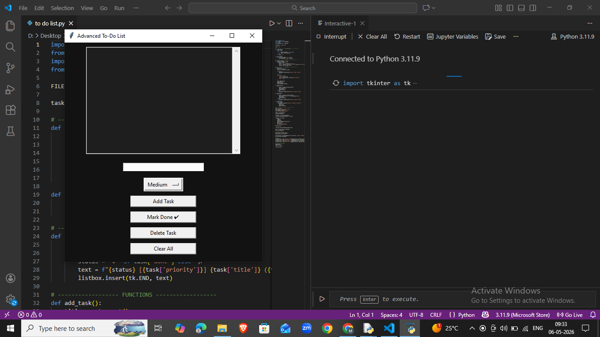

<h1 align="center">🚀 Advanced To-Do List App</h1>

  <b>A powerful, modern, and persistent To-Do List built with Python</b> 
  <i>Designed for productivity • Built for performance</i>

  
  
  
  
  

---

## ✨ Overview

This is not just a basic to-do app.  
It is a **feature-rich task manager** built using Python that demonstrates:

- 🧠 State management  
- 💾 Persistent storage  
- 🎨 GUI design  
- ⚙️ Real-world application logic  

---

## 🖼️ Preview

  

---

## 🚀 Core Features

🔥 Add tasks with priority levels (High / Medium / Low)  
✔️ Mark tasks as completed  
🗑️ Delete individual tasks  
🧹 Clear all tasks with confirmation  
💾 Automatic saving using JSON  
🕒 Timestamp tracking  
📜 Scrollable task view  
🌙 Dark-themed interface  

---

## 🧠 How It Works

- Tasks are stored as structured data (`dict`)  
- Data is saved in a local `tasks.json` file  
- On launch → tasks are automatically loaded  
- UI updates dynamically based on task state  

---

## 📦 Project Structure

advanced-todo-app/
│── advanced_todo.py
│── tasks.json
│── screenshot.png
│── README.md

---

## ⚡ Installation & Usage

Clone the repository:

    git clone https://github.com/Moksh-dev/advanced-todo-app.git

Navigate into the project:

    cd advanced-todo-app

Run the application:

    python advanced_todo.py

---

## 🎯 Future Enhancements

- 🔍 Search & filter tasks  
- 📅 Due dates & deadlines  
- 📊 Productivity analytics  
- 🔔 Notifications / reminders  
- 🌐 Web-based version  

---

## 🧪 Skills Demonstrated

- Python programming  
- GUI development with Tkinter  
- File handling (JSON)  
- Data structures & state logic  
- User experience design  

---

## 🤝 Contributing

Contributions are welcome!  
Feel free to fork, improve, and submit a pull request 🚀  

---

## ⭐ Support

If you found this project useful or interesting,  
please consider giving it a ⭐ — it helps a lot!

---

## 👨‍💻 Author

**Mokee**  
Built with ❤️ using Python
